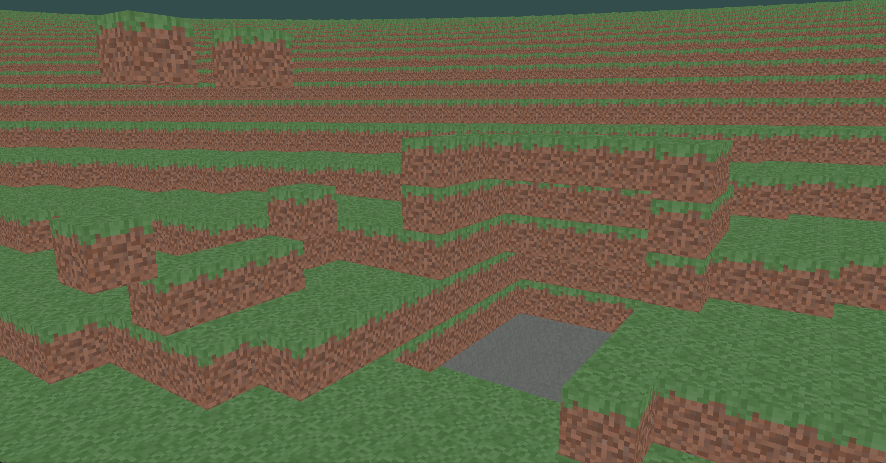

# **Minecraft Clone C**

This is a WIP Minecraft clone made entirely in C using its own OpenGL engine.

## Requirements

Libraries needed: 

- OpenGL
- GLFW3

You'll need to specify the path to GLFW3 inside the CMakeLists.txt

## Build and Run

### Windows

    mkdir build && cd build && cmake .. && cmake --build .

    .\Debug\main.exe

### Unix

    mkdir build && cd build && cmake .. && make

    ./main

