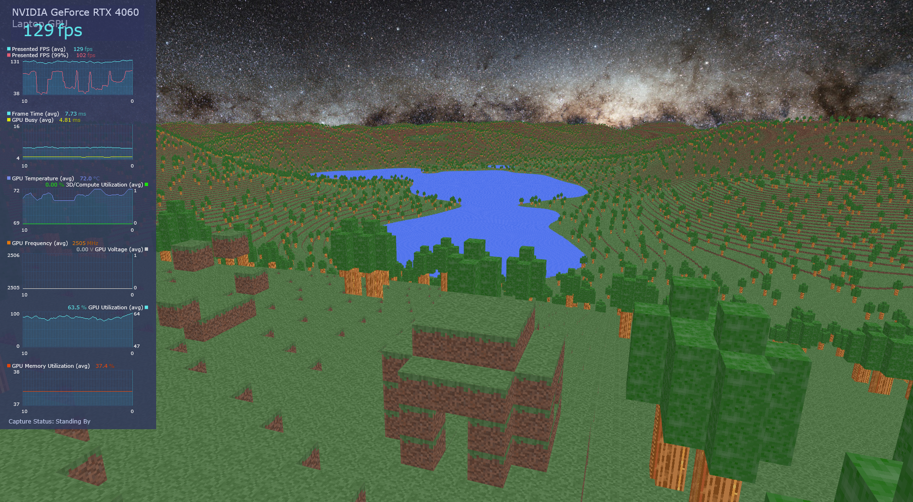

# **Minecraft Clone C**

This is a WIP Minecraft clone made entirely in C using its own OpenGL engine.

Here's an view with a render distance of more than 3000 blocks, everything is rendered without any decreasing level of detail.

Chunk generation is also multithreaded allowing fast mouvement.

In order to render each chunk, the outer mesh is first generated, consisting of every visible block face. Afterwards, the mesh is processed by greedy meshing to reduce the number of triangles. The data for each face (including offsets within the chunk, texture information, greedy mesh size, etc.) is then packed into two 32-bit integers. This data is sent to the GPU using instanced rendering, where each instance represents a simple block face that is then transformed using the packed data.

## Requirements

Libraries needed: 

- OpenGL
- GLFW3

You'll need to specify the path to GLFW3 inside the CMakeLists.txt

## Build and Run

### Windows

    mkdir build; cd build; ..\compile_windows.ps1; ..\world_gen.ps1

    .\main.exe

### Unix

    mkdir build && cd build && cmake .. && make

    ./main

